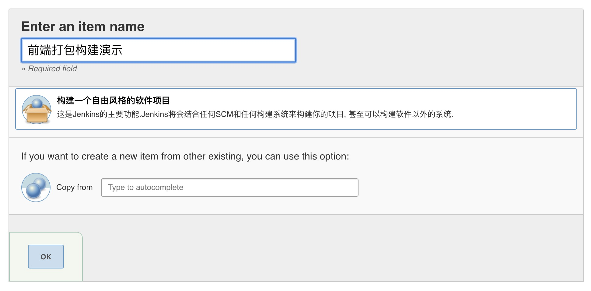
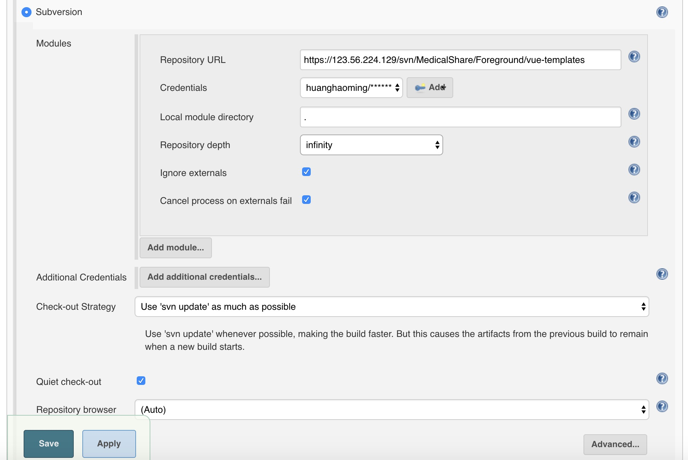
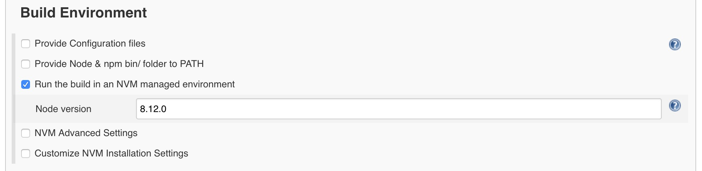
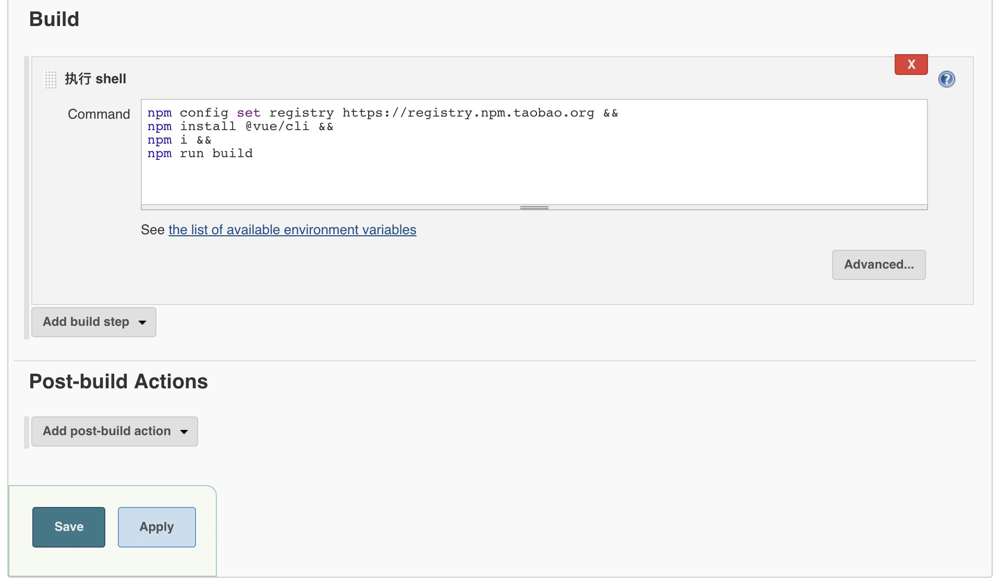

<description>
## 使用Jenkins部署
鉴于后端系统使用 Jenkins 进行部署，前端如果也用 Jenkins 进行部署可以使得整个项目的部署更加流畅和人性化。
### 步骤一：安装 Jenkins 插件
所需插件：`NodeJS Plugin`，`nvm wrapper`，`Subversion Plug-in`
### 步骤二：创建任务
创建一个名为`前端打包构建演示`的任务，并且选中`构建一个自由风格的软件项目`。再点击`OK按钮`，如下图所示：

### 步骤三：配置代码源
配置代码svn地址及svn账号，如下图所示：

### 步骤四：设置构建环境
设置在 `nvm` 环境中构建，并且设置node版本号为：`8.12.0`，如下图所示：

### 步骤四：设置构建步骤
添加一个`执行shell`，并且将下面的命令粘贴进去。
```` html
npm config set registry https://registry.npm.taobao.org &&
npm install @vue/cli &&
npm i &&
npm run build
````

### 步骤五：保存
点击 `Save` 保存即可。
### 步骤六：执行构建任务
点击`立即构建`后会进入构建过程，构建完成后，项目的`Workspace`中`dist`就是构建完成的文件。
### 其它
#### 部署
构建完成后可以需要将文件上传到服务器或者移动到指定目录，这些操作请根据项目需要再做扩展。
#### 集成进后端程序的构建步骤中
可以将这个前端构建任务的`Build Triggers`设置为`其他工程构建后触发`，以达到和主部署任务结合的目的。
</description>
